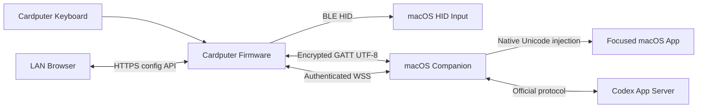

# Cardputer Codex Companion 设计规格

- 状态：全部设计章节已于 2026-07-24 获得确认，等待书面规格复核
- 目标平台：M5Stack Cardputer + macOS
- 首版网络边界：同一局域网
- 文档性质：实施前的产品与技术设计依据

## 1. 产品目标

Cardputer Codex Companion 将 Cardputer 变成：

1. 可独立工作的可编程蓝牙键盘；
2. Codex 的局域网遥控器；
3. 展示活跃会话和待处理状态的副屏；
4. 通过设备自身 Web 控制端配置按键、组合键和 UTF-8 字符串宏的工具。

首版只支持 macOS，不要求离开局域网后继续控制 Codex。Cardputer 不保存 OpenAI 或 ChatGPT 凭据，也不直接读取或修改 Codex 内部数据库、JSONL 或其他私有状态文件。

## 2. 硬性需求

- Cardputer 通过 BLE HID 连接电脑并作为标准键盘使用。
- Cardputer 连接 Wi-Fi 后提供设备端 Web 控制页。
- 用户能够配置物理键、键盘层、组合键和字符串宏。
- 字符串宏必须支持中文 UTF-8 文本。
- 副屏展示活跃及近期 Codex 会话、运行状态、审批和输入请求。
- 用户能够通过设备创建和恢复会话、输入并确认发送自由文本 Prompt、以选项或文本回答问题、批准或拒绝审批、中断 turn、compact 会话并选择预配置工作目录。
- Wi-Fi、Companion 或 Codex 不可用时，基础 BLE 键盘能力仍然可用。

## 3. 首版非目标

- 公网控制、云端中继、端口映射或离开局域网后的访问；
- Windows、Linux、iOS 或 Android Companion；
- 在 Cardputer 上复制完整 Codex 终端或完整会话记录；
- 任意 Shell、脚本、循环、条件表达式、插件或未经白名单约束的 Codex RPC；
- 绕过 Codex App Server 修改内部文件；
- 在 Companion 缺失时通过键盘布局猜测中文输入；
- 自动更新 Companion；
- 依赖 microSD 才能正常启动、配置、恢复或升级。

协议可以保留将来扩展能力，但 v1 不实现上述范围。

## 4. 技术基线

### 4.1 固件

- ESP-IDF 5.x；
- C++ 模块化组件；
- 复用 M5Stack 官方硬件库或经验证的 UserDemo HAL 模式；
- FreeRTOS 任务、队列和看门狗；
- NimBLE/ESP-IDF BLE、NVS、OTA、mbedTLS 和设备端 HTTPS 服务；
- 固件构建必须支持 Cardputer 的 8MB Flash、512KB SRAM 且无 PSRAM 的资源约束；
- 发布固件启用 Secure Boot v2、Flash Encryption 和 NVS Encryption；开发固件必须清楚标记为非发布构建。

### 4.2 macOS Companion

- Swift 原生用户态 Agent；
- 以 LaunchAgent 方式登录启动，并提供最小菜单栏配对与诊断入口；
- 使用 CoreBluetooth、Network、Keychain、ApplicationServices、OSLog 和 SQLite；
- 通过适配器对接本机 Codex App Server；
- 不提供独立云端后端。

### 4.3 Web 控制端

- Vue 3 + TypeScript + Vite；
- 产物压缩后嵌入固件，不使用外部 CDN；
- 页面只调用设备本地版本化 API；
- 构建阶段检查压缩资源及最终固件镜像体积。

如果 Phase 0 证明某项技术基线无法满足硬门槛，必须回到设计复核，不能静默改变安全或功能边界。

## 5. 总体架构



系统由 Cardputer 固件和 macOS Companion 两个运行组件构成。BLE HID、自定义 BLE GATT 和 LAN WebSocket 是相互独立的三条数据通道：

- BLE HID：普通键、修饰键和组合键；
- BLE GATT：UTF-8 字符串注入；
- LAN WebSocket：Codex 会话、事件和控制命令。

设备 Web 控制端由 Cardputer 自身托管并直接修改设备配置，不要求 Companion 在线。

## 6. 固件组件边界

固件拆分为以下独立组件：

| 组件 | 职责 | 主要依赖 |
|---|---|---|
| Keyboard Scanner | 读取物理键和 Home/G0 按钮 | Cardputer HAL |
| Input Router | 根据当前模式决定 HID、宏或 UI 路由 | Scanner、Profile Store |
| HID Engine | 生成标准键盘报告并保证释放 | BLE |
| Macro Engine | 执行受限输入序列 | HID、GATT、Command Client |
| Profile Store | 校验、持久化和原子切换配置 | NVS、双槽配置区 |
| BLE Text Service | 分片、认证和确认 UTF-8 请求 | BLE、Pairing Store |
| Companion Client | 发现、认证、同步和发送 Codex 命令 | Wi-Fi、WSS |
| UI State Store | 保存规范化的只读屏幕模型 | Companion Client |
| Screen Renderer | 以 line/tile buffer 绘制 240×135 UI，不保留全屏双缓冲 | M5 display |
| Web Control | 托管 SPA、认证和配置 API | Wi-Fi、Profile Store |
| Provisioning | 首次 Wi-Fi 配置和恢复配网 | Wi-Fi、NVS |
| Update Manager | 验签、双槽 OTA 和健康确认 | OTA、Crypto |

Keyboard Scanner 与 HID Engine 具有最高运行优先级。Web、网络、屏幕和 Codex 事件通过有界队列通信；任何网络等待都不得进入键盘扫描或 HID 发送路径。

## 7. Companion 组件边界

| 组件 | 职责 |
|---|---|
| Device Discovery | 发布 mDNS、发现设备连接并匹配已配对身份 |
| Pairing Manager | 短验证码、P-256 身份和撤销 |
| Device Protocol Server | WSS 握手、消息验证、游标和背压 |
| BLE Text Client | 接收 UTF-8 分片、去重并确认 |
| Unicode Injector | 使用 macOS 原生能力向前台应用注入 Unicode |
| Codex Adapter | 隔离 Codex App Server 的版本与协议差异 |
| State Normalizer | 将原始事件压缩为设备需要的会话模型 |
| Command Executor | 校验会话、请求 ID、工作目录和状态前置条件 |
| Persistent Store | 非敏感设置、收藏工作目录及配对元数据 |
| Diagnostics | 脱敏日志、健康状态和菜单栏反馈 |

Cardputer 只看到稳定的 Companion 协议，不依赖 Codex App Server 的原始字段。Companion 升级可以适配 Codex 变化而不要求同步改动固件。

## 8. Profile 与宏模型

### 8.1 Profile

设备最多提供 8 个 Profile，包括 1 个固件内置 Safe Profile 和最多 7 个用户 Profile；每个用户 Profile 最多包含 4 个键盘层。Profile 使用不可变默认物理键位加稀疏覆盖：

- 未配置：透传物理键原始 HID usage；
- 已覆盖：执行指定绑定；
- 已禁用：按键不产生普通输入；
- Home/G0 和开机恢复组合键 `Home/G0 + Fn` 不属于可编辑键位。

每个 Profile 至少包含：

- `profile_id`
- `name`
- `revision`
- `schema_version`
- `layers`
- `bindings`

固件内置不可修改、不可删除、不可导入覆盖的 Safe Profile。用户 Profile 可以完全重映射所有非保留键。

### 8.2 绑定类型

| 类型 | 语义 |
|---|---|
| `passthrough` | 发送按键原始 HID usage |
| `hid_chord` | 修饰键加最多 6 个普通 HID 键 |
| `text_utf8` | 请求 Companion 注入 UTF-8 字符串 |
| `input_sequence` | 顺序执行组合键、文本和有限延时 |
| `device_action` | Profile 切换或设备 UI 动作 |
| `codex_action` | 一个白名单内的结构化 Codex 动作 |
| `disabled` | 明确不执行任何动作 |

`input_sequence` 最多 16 个步骤，单段 UTF-8 文本最多 1024 字节，总延时不超过 10 秒。v1 不支持循环、条件、嵌套宏、任意脚本、Shell 或原始 RPC。

### 8.3 输入安全

- 每个 HID 动作结束后发送完整 `release all`。
- Profile 切换、BLE 断线、宏取消、异常和看门狗超时同样执行 `release all`。
- 文本操作携带唯一 ID；Companion 在结果账本保留期内去重并返回已知结果。过期或崩溃窗口无法确认时返回 `indeterminate`，不得声称未执行或自动重放。
- Companion 不在线时，文本宏明确失败，不转换为键盘布局序列。
- Codex 动作包含目标 `session_id`、请求 ID 和状态前置条件。
- 工作目录使用 Companion 中的收藏 ID，Cardputer 不能提交任意文件系统路径。

### 8.4 高风险动作

- 会话浏览、滚动和选择可以单键执行。
- Prompt 宏只把内容放入草稿，必须再次确认发送。
- Approval 绑定只打开审批详情，不能直接批准。
- 批准前必须显示会话、工具、命令或文件范围；只有用户滚动或分页浏览完全部必显详情后才启用批准，再进行第二次物理确认。拒绝始终可用。
- 中断和 compact 要求长按确认，且不能隐藏在组合宏中。

## 9. 设备操作模式与屏幕

### 9.1 模式隔离

```text
Keyboard Mode -- Home/G0 --> Codex Remote Mode
      ^                           |
      +--------- Home/G0 --------+
```

- Keyboard Mode 是默认模式，按键依据 Profile 路由。
- Codex Remote Mode 中普通按键只操作设备 UI，不发送 HID。
- 任意模式长按 Home/G0 2 秒，启用 Safe Profile、释放 HID 并返回 Keyboard Mode。
- 开机时持续按住 `Home/G0 + Fn` 进入恢复路径：强制 Safe Profile、禁用网络自动连接并打开本地恢复菜单。

### 9.2 常驻副屏

键盘模式显示：

- BLE、Wi-Fi 和 Companion 状态；
- 电量；
- 当前 Profile；
- 当前选中会话和工作目录简称；
- 会话状态及持续时间；
- Approval 与 Input Request 数量。

统一状态为：

| 状态 | 含义 |
|---|---|
| `RUN` | 模型生成或工具执行中 |
| `INPUT` | 等待用户回答 |
| `APPROVAL` | 等待审批 |
| `READY` | turn 已结束，可继续 |
| `ERROR` | 当前操作失败 |
| `STALE` | Companion 断线，显示缓存快照 |

状态必须同时使用文字或图标，不能只依赖颜色。

### 9.3 遥控页面

1. Dashboard：显示当前会话、待处理数量和连接摘要；
2. Sessions：显示活跃及近期会话，当前选中项不会因新事件突然重排；
3. Session Detail：显示工作目录、状态、最近事件摘要和允许动作；
4. Compose：接收 Cardputer 键盘的自由文本，可插入已配置 UTF-8 snippet，最终由用户确认发送；
5. New Session：先选择 Companion 收藏工作目录，再输入并确认发送首个 Prompt；
6. Input Request：支持 App Server 提供的选项回答或自由文本回答；
7. Approval Detail：按审批类型展示必需字段，并只提供该请求明确允许的批准或拒绝决策；
8. Connection/Profile：查看 BLE、Wi-Fi、Companion、当前 Profile 和配对状态。

方向键移动、Enter 选择、Esc/Back 返回。Home/G0 始终切换回 Keyboard Mode。

Approval 或 Input 到达时只更新角标并短暂唤醒屏幕，不自动抢占用户当前页面。屏幕休眠时，Keyboard Mode 的第一个按键仍然发送给主机，不能只用于唤醒。

界面保存完整 UTF-8 文本并使用紧凑 CJK 字体。超长内容逐行滚动，缺失字形显示替代符。绘制按事件触发并限频，不能阻塞输入路径。

## 10. Wi-Fi 配网与设备 Web 控制

### 10.1 首次配网

设备没有可用 Wi-Fi 配置时进入临时 AP：

- SSID 包含设备短 ID；
- 随机 AP 密码显示在 Cardputer 屏幕；
- Captive Portal 只允许选择 SSID 并提交密码；
- 成功连接后立即关闭 AP；
- Wi-Fi 密码永远不能从 API、页面或导出文件读回。

正常运行时不同时开放 AP。重新配网必须由设备菜单明确触发。

### 10.2 管理入口

联网后通过唯一 mDNS 名称访问，例如 `https://cardputer-codex-3f2a.local`。设备使用每台设备独立的 HTTPS 身份；首次连接时屏幕提供证书指纹供确认。

未认证客户端只能看到设备名称和配对提示。无认证的 `/healthz` 只返回固定的 `ok`、固件版本和是否需要配对，不返回 Profile、宏、网络、会话、设备标识或配对信息。

首次 Web 管理配对：

1. 用户从设备开启 5 分钟配对窗口；
2. 屏幕显示一次性 8 位代码；
3. 浏览器提交代码；
4. 设备显示浏览器名称并要求物理确认；
5. 确认后生成该浏览器独立、可撤销的管理凭据。

单个窗口累计 5 次失败后立即关闭并进入 10 分钟退避。最多保留 5 个管理客户端。已配对客户端凭据独立可撤销；管理会话空闲 30 分钟失效。管理 Cookie 使用 `Secure`、`HttpOnly` 和 `SameSite=Strict`，所有写请求还需 CSRF Token，并校验 `Host` 与 `Origin`。设备不支持 CORS。

为保护 512KB SRAM，v1 设置以下硬限制：

- 最多 4 个已建立 HTTPS 连接，同时最多执行 1 个 TLS 握手；
- 单个请求头不超过 8KB，普通请求体不超过 16KB；
- 配置导入最大 128KB，必须流式解析，JSON 嵌套深度不超过 8；
- WebSocket 单帧不超过 16KB；
- 单个已认证客户端平均不超过每秒 10 个请求，突发上限 20；
- 每个源地址的 TLS 握手不超过每分钟 3 次、全局不超过每分钟 6 次；限流状态表最多保存 16 个源；
- 未认证请求每个源平均不超过每秒 1 次、突发上限 4；`/healthz` 全局不超过每秒 10 次；
- 超限请求在分配大块缓冲区前拒绝，并纳入 Phase 0 资源耗尽测试。

### 10.3 Web 功能

- 连接与设备状态；
- Profile 新建、复制、重命名、删除和切换；
- 按实际物理布局编辑每个键盘层；
- 宏与 UTF-8 snippet 库；
- 宏步骤和容量预览；
- Companion 配对状态；
- 已配对 Web 管理客户端的查看、命名与撤销；
- 版本化配置导入、导出及恢复最后有效版本。

编辑使用“草稿、校验、发布”。保存请求携带基础 revision；revision 不匹配时返回冲突，不能覆盖其他页面的新修改。

设备检查容量、保留键、动作白名单、层数、步骤数、文本长度和宏引用后才原子切换配置。测试默认只显示模拟结果；真实发送到主机需要再次确认。

导入文件必须包含 `device_class` 和 `schema_version`。已知旧版本先迁移到草稿并展示差异；比固件更新或无法迁移的 schema 直接拒绝。导出内容不包括 Wi-Fi 密码、管理凭据、Companion 密钥或 Codex 数据。

## 11. Cardputer 与 Companion 配对

Companion 通过 `_codex-companion._tcp.local` 发布：

- 实例名称；
- 实例 ID；
- 协议主版本；
- 服务端口；
- 公钥指纹摘要。

用户在 Cardputer 上选择目标 Mac 后，双方交换长期 P-256 公钥、临时 ECDH 公钥和随机 nonce。双方对完整 transcript 计算 SHA-256，并从 ECDH 共享秘密通过 HKDF-SHA256 导出 6 位 SAS；SAS 同时显示在 Mac 和 Cardputer 上，只有两端分别确认一致后才能完成配对。长期身份、临时密钥、双方 nonce 和实例 ID 都必须进入 transcript，防止中间人替换身份。

确认后，HKDF 使用独立 context label 派生配对根密钥和 `gatt-auth` 密钥，禁止跨协议复用。配对建立相互固定的身份：

- Mac 私钥保存在 Keychain；
- Cardputer 私钥和信任记录保存在加密 NVS；
- WSS 固定 Companion TLS 证书的 SPKI；TLS 建立后，Cardputer 使用长期 P-256 私钥签署 `TLS exporter + Companion instance ID + device ID + protocol version + 256-bit random challenge`，完成与当前 TLS channel 绑定的客户端身份验证；
- 自定义 GATT 要求 BLE LE Secure Connections 与已认证 bonding；每次 BLE 连接由 Companion 生成新的 128-bit `connection_id`，设备计数器从 0 开始，并使用 `gatt-auth` 密钥对连接 ID、操作 ID、计数器和分片内容生成认证标签；
- Companion 为每台设备维护独立的 GATT 接收计数器和有限乱序窗口，重复或回退的计数器直接拒绝；
- IP 地址变化不影响身份；
- 任一端都能撤销；
- 身份变化必须重新物理配对。

每次 BLE 断开都废弃 `connection_id` 和该连接的计数器窗口；持久化 operation ID 账本继续用于跨连接去重。

首次 Companion 配对需要 Wi-Fi，并要求目标 Mac 同时完成 BLE bonding。Companion 通过 WSS 和 GATT 同时发送一次性 bind challenge，Cardputer 只有在两条通道的 challenge 一致时才把 BLE bond 与 Companion 身份关联。完成配对后，即使 Wi-Fi 暂时不可用，已配对 Mac 仍可通过 BLE GATT 完成 UTF-8 注入。

v1 只允许 1 个活动 HID 主机 bond。HID 配对只在用户从设备开启的 5 分钟物理窗口内接受；更换主机必须在设备端确认，并同时撤销旧 HID bond、对应 GATT 绑定和 Companion 设备凭据。未绑定到当前 Companion 身份的 BLE central 不能访问文本 Characteristic。

Web 管理配对与 Companion 配对是两个独立权限域，任何一方凭据不能替代另一方。

Companion 只监听用户选定的本地 LAN 接口，并只接受从该接口本地子网到达的连接；不启用 UPnP、NAT-PMP、Cloudflare Tunnel 或任何公网监听。接口变化后需要在 Mac 端确认新的发布接口。

发布设备的根信任建立流程必须先烧录 Secure Boot v2 公钥摘要，再启用 Flash Encryption/NVS Encryption，并验证 USB 恢复镜像仍满足签名策略。该 eFuse 流程是不可逆发布步骤，不在普通开发构建中自动执行。

## 12. LAN 协议

### 12.1 连接状态

```text
DISCOVER -> CONNECT -> AUTHENTICATE -> SYNC -> LIVE
              ^                         |
              +-------- BACKOFF <-------+
```

心跳间隔 10 秒，连续 3 次失败进入 `STALE`。重连使用带抖动的 `1、2、5、10、30` 秒退避，上限 30 秒。

### 12.2 消息封装

WebSocket 使用版本化 JSON：

```json
{
  "protocol": "1.0",
  "type": "command",
  "message_id": "018f5e6b-example",
  "reply_to": null,
  "stream_id": "companion-boot-uuid",
  "cursor": 1842,
  "sent_at": 1784822400000,
  "payload": {}
}
```

- 主版本不兼容：禁止 Codex 控制并提示升级。
- 次版本差异：通过 capability negotiation 关闭不支持的功能。
- `message_id` 用于命令幂等和结果查询。
- `stream_id` 是 Companion 每次启动生成的新 epoch；`cursor` 只在同一 `stream_id` 内单调递增，设备时间不参与排序。
- 长操作立即返回 `accepted`，最终结果通过事件发送。

设备方向的单帧上限为 16KiB。会话列表每页最多 20 条，标题不超过 96 个 UTF-8 字节、工作目录显示名不超过 64 字节、普通事件摘要不超过 256 字节。超过单帧的审批详情必须使用带总长度、分片序号和整体 SHA-256 的分页详情协议；所有分片验证完成以前不能启用批准。

### 12.3 规范化命令

- `session.create`
- `session.resume`
- `prompt.submit`
- `input.respond`
- `approval.resolve`
- `turn.interrupt`
- `session.compact`
- `workspace.select`

Companion 不接受 Cardputer 发送的任意 Codex 方法名、任意路径或未定义字段。

### 12.4 事件

- 会话 upsert/remove；
- 活动会话变化；
- turn 状态；
- Approval requested/resolved；
- Input requested/resolved；
- 命令 accepted/completed/failed；
- Companion 和 Codex 可用性。

初次连接、`stream_id` 变化或游标断层时发送完整快照。只有 `stream_id` 相同且游标连续时才能重放增量。设备必须原子安装完整快照或完整增量批次；同步完成前保持 `STALE` 并禁用所有 Codex 写操作。

Companion 至少保留最近 1000 条事件，同时至少覆盖最近 15 分钟；一条事件只有同时超出数量和时间保留边界时才可淘汰。

普通状态更新可以按会话合并。Approval、Input 和命令结果不能静默丢弃；无法保证连续性时发送 `resync_required` 并重新同步快照。

### 12.5 命令结果账本

Companion SQLite 必须持久化操作账本，至少包含：

- `paired_device_id`
- `message_id`
- 操作类型
- payload SHA-256
- 目标 session/request ID
- `intent`、`accepted`、`completed`、`failed` 或 `indeterminate` 状态
- 脱敏结果或稳定错误码
- 创建、更新时间和过期时间

唯一键是 `(paired_device_id, message_id)`，结果只能由发起该操作的已认证设备查询。同一键携带不同 payload hash 时返回 `invalid_request`。

执行外部副作用前，先以事务写入 `intent`。App Server 返回后再提交结果。`completed`、`failed` 和 `indeterminate` 是终态；`intent` 和 `accepted` 是非终态。Companion 重启后必须立即对账，无法在数据库打开后 60 秒内收敛的非终态操作转为 `indeterminate`。

账本保留至少 4096 个近期操作且至少覆盖 24 小时；只有处于终态、同时超出数量和时间边界的记录才可淘汰。

SQLite 事务无法与 App Server 副作用构成分布式原子提交。Companion 若在副作用发生后、结果落盘前崩溃，应在重启时通过 App Server 当前状态尝试对账；无法证明结果时将操作标记为 `indeterminate`。设备收到 `indeterminate` 或过期结果时必须要求用户检查当前会话，禁止自动重放。

### 12.6 稳定错误码

至少包括：

- `invalid_request`
- `unauthenticated`
- `forbidden`
- `unsupported`
- `not_found`
- `stale_state`
- `busy`
- `codex_unavailable`
- `companion_unavailable`
- `permission_denied`
- `secure_input_active`
- `partial`
- `indeterminate`
- `result_expired`
- `timeout`
- `resync_required`

设备根据错误码提供可执行提示，而不是展示原始异常。

## 13. BLE UTF-8 协议

自定义 GATT 消息使用二进制分片帧：

- 协议版本；
- 唯一操作 ID；
- 分片序号和总数；
- UTF-8 总长度；
- 数据；
- 完整消息校验；
- 配对密钥认证标签。

Characteristic 只允许已加密 BLE 连接访问。Companion 按操作 ID 去重并返回 `accepted`、`completed` 或明确错误。

Companion 在 SQLite 中以 `(paired_device_id, operation_id)` 为唯一键，保存 payload SHA-256、目标前台 PID/AX 元素标识、已投递 Unicode 前缀长度、状态和时间，不保存字符串正文。结果只能由发起设备查询。

第一块 Unicode 注入以前，必须先以事务写入 `intent`。每块投递后更新 `posted_prefix_length`；仅当目标 AX 值可读并确认变化时，才额外记录 `verified_prefix_length`。账本至少保留最近 256 个操作，同时至少覆盖最近 10 分钟；只有处于终态、同时超出数量和时间边界的记录才可淘汰。

状态未知时设备必须查询原操作结果，不能直接再次注入。账本过期返回 `result_expired`；崩溃窗口无法确认返回 `indeterminate`。

Unicode Injector 在开始时绑定前台 PID 和聚焦 AX 元素，并在每个 Unicode 块注入前复核焦点。焦点变化时立即停止，返回 `partial` 和 `posted_prefix_length`；该字段只表示已提交给系统事件路径，不宣称目标应用必然接受。设备不得自动补发剩余文本。崩溃后若不能证明最后一块是否已写入，同样返回 `indeterminate`。

Unicode Injector 不依赖当前键盘布局。遇到 Accessibility 未授权、Secure Input 或目标应用拒绝输入时，返回明确失败，不能偷偷改用剪贴板或模糊的合成 Command-V。Phase 0 必须覆盖完整 1024 字节文本、注入中途切换焦点、Companion 重启以及签名升级后的 TCC 权限保持。

## 14. Codex App Server 集成

Companion 是唯一 Codex 集成边界：

- 启动或连接本机官方 Codex App Server；
- 把原始 thread、turn、item、approval 和 user-input 事件映射为稳定设备状态；
- 生成自己的事件 cursor；
- 限长并清理屏幕摘要；
- 对每个变更命令检查当前状态；
- 只允许选择 Companion 预配置的工作目录；
- 不向设备发送完整日志、隐藏推理、未筛选工具输出或凭据。

Approval Adapter 必须把 App Server 请求映射为有限 DTO：

| 类型 | Cardputer 必须显示 |
|---|---|
| `exec` | 完整命令、工作目录和风险摘要 |
| `file_change` | 文件路径、增删改数量、可滚动变更摘要和上游提供的可选 `grantRoot` |
| `network` | 目标主机、端口、协议和请求原因 |
| `permission` | 权限范围、原因和有效范围 |
| `unknown` | 原始类型标识和“不支持批准”提示 |

Companion 内部映射必须保留 `threadId`、`turnId`、`itemId`、approval request ID 和状态版本，设备 DTO 至少携带不会歧义的 session/request 复合标识。设备可显示的决策是上游 `availableDecisions` 与设备 capability 的交集。

v1 规范化决策为 `approve_once`、能力允许时的 `approve_for_session` 以及 `reject`。未识别类型只能拒绝或返回 Mac 处理，绝不能批准。exec-policy amendment 等扩展决策只有 Companion 明确声明 capability 且设备存在对应安全 UI 时才可出现。

Input Request Adapter 必须区分选项输入和自由文本输入。实验性或未知 schema 受 capability 门禁控制；Cardputer 不理解的请求保留在 Mac 端处理，不能猜测字段或发送空答案。

Phase 0 必须以当前安装版本验证全部必需能力。若官方接口缺少任一硬性控制能力，应暂停后续阶段并回到设计复核；不得以修改 Codex 内部数据库或 JSONL 代替。

## 15. 持久化与隐私

### 15.1 Cardputer

- 固件镜像：Safe Profile、恢复 UI、发布公钥；
- 加密 NVS：Wi-Fi、设备身份、信任关系和活动配置指针；
- 标记为 encrypted 的双槽自定义分区：Profile、宏、管理客户端 verifier、schema、generation 和 revision；
- RAM：Codex 会话快照、Prompt、Approval 和事件摘要。

Web 管理 token 使用 256-bit 随机值，设备分区只保存 `HMAC-SHA256(device wrapping key, token)` verifier 和客户端元数据，不保存可重用 bearer 明文。Flash/NVS Encryption 未启用的开发构建不能登记为发布设备。

配置更新流程：

```text
写入非活动槽 -> 校验结构、容量和 SHA-256
-> 原子切换活动指针 -> 加载验证
```

每个配置槽记录 schema 版本、generation、写入固件版本、长度和 SHA-256。启动时选择 generation 最高且与当前固件兼容的有效槽，而不是无条件相信单一活动指针。

断电或验证失败继续使用旧槽。设备只持久化最后 `stream_id + cursor` 和选中会话 ID，不持久化 Codex 内容。

提供三种恢复：

1. Profile/宏恢复；
2. Profile/宏和 Wi-Fi 恢复；
3. 完全恢复并清除所有信任关系。

连续启动失败进入 Safe Profile 和网络禁用状态，但不自动擦除数据。

### 15.2 Companion

- Keychain：私钥和设备秘密；
- Application Support SQLite：收藏工作目录、设备名称、非敏感设置、LAN 命令结果账本和 GATT 注入结果账本；
- RAM：事件缓冲与会话快照；
- OSLog：脱敏运行日志。

收藏工作目录只能通过 Companion 菜单栏设置添加、命名、禁用或删除。设备仅接收不透明 workspace ID、显示名称和可用状态。

默认日志和结果账本不能记录 Prompt 正文、字符串宏、凭据或完整命令参数；账本只保存 payload hash、目标标识、状态和必要的脱敏结果。

## 16. OTA 与版本兼容

Cardputer 使用双 OTA 分区。Web UI 和 CJK 字体与固件一起构建，避免资源与 API 版本漂移。CI 以实际分区表为准设置硬性镜像大小上限。

OTA manifest 包含：

- 硬件型号；
- 固件版本；
- 协议版本范围；
- 配置 schema 范围；
- 镜像长度；
- SHA-256；
- ECDSA P-256 发布签名。

发布私钥不得进入仓库、固件或 CI 日志。OTA manifest 验证、公钥摘要和 Secure Boot v2 必须使用一致的发布信任链；USB 恢复不能成为加载未签名镜像的旁路。

更新前检查型号、空间、电量或 USB 供电，并停止宏、发送 HID `release all`。新镜像写入非活动分区。

首次启动只有完成键盘扫描、显示、配置加载、BLE 初始化和看门狗自检后才标记健康；失败由 bootloader 回滚。

候选固件迁移配置时只写入非活动槽，并保留旧 schema 槽。候选镜像标记健康以前禁止用户配置写入，确保自动固件回滚仍能选择原来的兼容槽。镜像确认后，正常配置更新才可以继续轮换双槽。

普通 Web OTA 禁止未授权降级。物理恢复模式只允许通过 USB 安装可信签名的旧版本，并在启动前检查是否仍存在兼容配置槽；若不存在，必须要求导入兼容备份或明确执行配置恢复。v1 不承诺在多次新 schema 配置写入后仍可无损降级到任意历史版本。

Companion v1 使用签名并 notarize 的安装包手动升级。升级保留 Keychain 和配置。协议不兼容时继续保留 BLE HID，同时禁用 Codex 控制并展示版本要求。

microSD 只用于可选备份和诊断导出。

## 17. 故障与恢复

| 故障 | 必须行为 |
|---|---|
| Wi-Fi 断开 | BLE HID 与已配对 GATT 保持可用，Codex 状态标记 STALE |
| Companion 退出 | HID 保持可用，文本宏快速失败，Codex 写操作禁用；重启产生新 `stream_id` 并全量同步 |
| Codex App Server 重启 | Companion 保持设备连接并发布 `codex_unavailable`，恢复后发新快照 |
| Cardputer 重启 | 先恢复 Safe/最后有效 Profile，再同步 Companion |
| Profile 损坏 | 使用最后有效槽；两槽均失败则 Safe Profile |
| 命令重复 | 账本保留期内通过 `message_id + payload hash` 返回已知结果；冲突 payload 拒绝 |
| 命令结果无法确认 | 返回 `indeterminate`，要求用户检查当前状态并禁止自动重放 |
| Approval 已变化 | 返回 `stale_state`，绝不作用于其他请求 |
| 队列溢出 | 合并普通状态；关键事件无法保证时强制 resync |
| BLE 中断或焦点变化发生在文本注入中 | 返回已知结果、`partial` 或 `indeterminate`，禁止盲目重发 |
| OTA 自检失败 | bootloader 回滚 |

## 18. 验证策略

### 18.1 Phase 0 硬门槛

在建设产品代码前先验证：

1. 在目标 Cardputer 硬件版本上，BLE HID、自定义 GATT、Wi-Fi、HTTPS 和 WSS 可同时运行，macOS 能把 HID 与 CoreBluetooth GATT 绑定到同一已配对设备；
2. TextEdit、VS Code、浏览器、Terminal 与 iTerm2 中的中文注入可靠，并能识别 Accessibility、Secure Input、焦点变化和部分完成；
3. 当前 Codex App Server 覆盖全部必需会话控制能力，并形成 thread、turn、compact、各类 Approval 和实验性 Input Request 的 capability 矩阵；
4. 固定分区表、压缩 Web UI 和明确授权的 CJK 字形集加入后，仍满足双 OTA 镜像预算；每个 OTA slot 的剩余空间不少于 slot 容量的 10% 或 256KiB，以较大者为准；
5. 最坏并发状态下，内部空闲 heap 不低于 64KiB、largest free block 不低于 32KiB；单个 TLS 握手和事件突发期间空闲 heap 不低于 40KiB、无分配失败；每个任务 stack high-water 至少保留 20% 或 1KiB，以较大者为准；未认证攻击流量饱和时仍满足 HID p95 指标；
6. SAS transcript 绑定、WSS 客户端挑战、GATT 防重放、Web 限流、Secure Boot、Flash/NVS Encryption 和签名 USB 恢复能够按规格闭环。

任一失败都暂停并返回设计复核。

### 18.2 自动化测试

- 固件宿主机单元测试：键位、宏、迁移、队列、状态机；
- 配置、JSON 和 GATT 解析器 fuzz；
- 固件/Companion 的 JSON、CBOR 和 GATT golden protocol fixtures；
- Companion 单元测试和模拟 App Server 集成测试；
- 当前本机 Codex App Server 契约测试；
- Web Playwright：键盘布局、revision 冲突、导入导出和认证；
- 镜像大小、格式化、静态检查、秘密扫描及签名验证；
- 未认证 TLS 握手、超限 Header/Body/JSON、WebSocket 大帧、请求突发、重放和配对暴力尝试的资源测试。

### 18.3 真机与故障测试

- 10,000 次组合键循环后不存在卡住、遗漏释放或错误修饰键；
- BLE、Wi-Fi、Companion 和 App Server 的独立断开与恢复；
- 中文注入中断、重复 ACK 和 Secure Input；
- 配置写入和 OTA 中断电；
- 旧审批、重放、无效签名和未配对访问；
- 多会话事件风暴和队列溢出；
- 8 小时持续运行后，无队列死锁、无持续内存下降超过 8KiB，HID p95 相对预热基线恶化不超过 10%。

### 18.4 v1 验收指标

- 无 Wi-Fi、无 Companion 时，字母、数字、修饰键、组合键及完整释放均可通过 BLE HID 使用；
- 至少 10,000 个样本中，从矩阵扫描产生稳定按键状态到 HID 报告进入 BLE 发送队列的延迟 p95 不高于 20ms；
- 在 LAN RTT 不高于 10ms、无人工丢包的基准网络中，至少 1,000 个事件从 Companion 写入事件队列到 renderer 完成包含该状态的显示帧传输，端到端延迟 p95 不高于 500ms；
- 同一 `stream_id` 的 5 秒网络中断恢复后，或 Companion 新 epoch 启动后，在链路重新可达起 10 秒内完成增量或全量同步并离开 `STALE`；
- 返回 `completed` 的中文宏必须与原 UTF-8 内容精确一致且不受键盘布局影响；焦点变化或崩溃只能显式返回 `partial` 或 `indeterminate`，不能误报成功；
- 未认证客户端不能读取或修改配置；
- 状态过期 Approval 必须拒绝；
- 损坏配置和失败 OTA 均能恢复到可用版本；
- 四项原始硬性需求与完整 Codex 遥控范围均有逐条自动化证据和真机演示记录。

## 19. 分阶段交付

### Phase 0 — Feasibility Gates

完成六项硬门槛探针、协议草案、Flash/RAM 预算、目标硬件版本记录和 App Server 能力矩阵。

### Phase 1 — Safe Keyboard

完成键盘扫描、Safe Profile、BLE HID、任务隔离、`release all` 和恢复路径。

### Phase 2 — Companion Core

完成 LaunchAgent、mDNS、配对、WSS、Codex Adapter 和模拟设备。

### Phase 3 — Profiles & Text

完成 Profile/宏存储、设备 Web UI、GATT UTF-8 和中文注入。

### Phase 4 — Codex Remote

完成会话副屏、Prompt、Input、Approval、中断、compact 和收藏工作目录。

### Phase 5 — Release Hardening

完成签名 OTA、配置迁移、安全、性能、长稳、安装包和用户文档。

每阶段必须产生可运行纵向版本并通过阶段退出条件，不能将第一次真机联调推迟到最后。

## 20. 参考实现与资料

- `M5Cardputer-UserDemo-main/main/apps/app_keyboard/ble_keyboard/ble_keyboarad.cpp`：BLE HID 数据路径参考，不直接信任或复制其中常量；
- `M5Cardputer-UserDemo-main/main/hal/keyboard/keymap.h`：键位发现参考；每个 HID usage 和 modifier 必须按标准及自动化测试独立验证；
- `M5Cardputer_Incident_Monitor/src/main.cpp`：签名请求、轮询和设备故障处理经验参考，不作为新架构基础；
- `codex_shadow`：现有会话和控制 API 原型参考；
- `Codex_on_Paper`：会话事件与 worker 契约参考；
- [M5Stack Cardputer 官方规格](https://docs.m5stack.com/en/core/Cardputer)；
- [M5Stack StampS3 官方规格](https://docs.m5stack.com/en/core/StampS3)；
- [Espressif ESP32-S3 硬件设计指南](https://docs.espressif.com/projects/esp-hardware-design-guidelines/en/latest/esp32s3/esp-hardware-design-guidelines-en-master-esp32s3.pdf)；
- [Codex App Server 官方文档](https://learn.chatgpt.com/docs/app-server)。

## 21. 实施前门禁

本规格获得书面复核后，下一步才是编制详细实施计划。实施计划必须：

- 将 Phase 0 作为不可跳过的第一阶段；
- 对固件、Companion、Web、协议和真机测试分配明确文件边界；
- 为每个阶段定义测试、演示和回滚条件；
- 不在未验证 App Server 能力前承诺替代性的内部文件写入；
- 不在正式实现前修改生产系统或对外发布服务。
